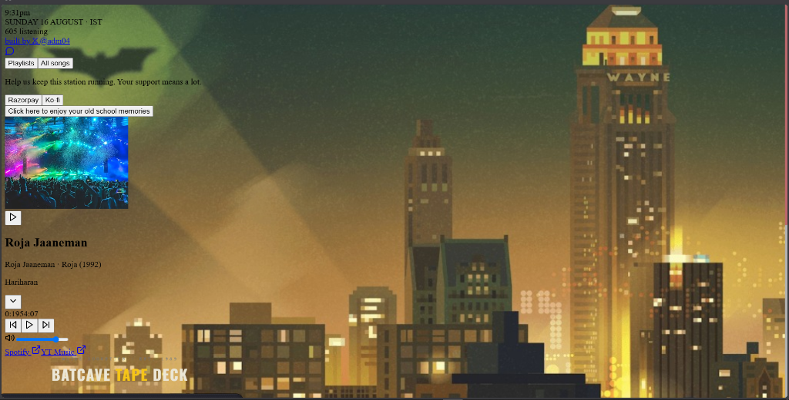

# 🦇 BATCAVE PLAYER · Δ-1939 Tape Deck

> *A retro-futuristic, skeuomorphic cassette tape deck player inspired by Gotham City and the Batcave.*

[](https://adm04.github.io/batcave-player/)
[](https://github.com/adm04)

---

## 📸 Preview



---

## ✨ Features

- **📼 Skeuomorphic Cassette Deck**: Model **Δ-1939** (Serial GC-0417) featuring brushed metal textures, spinning reel animations, interactive volume knob, tactile power toggle, and dynamic LED state indicators.
- **🔊 Pure Audio YouTube Streaming**: Hidden YouTube IFrame API audio engine that streams tracks seamlessly in the background without displaying video boxes.
- **🌧️ Drizzle Rain Canvas Animation**: 60fps HTML5 Canvas rendering realistic Gotham City drizzle rain overlay behind the tape deck.
- **👥 Real Live Listener Counter**: Powered by **Supabase Realtime Presence**, tracking exact active concurrent listeners globally in real-time across browser sessions.
- **🕒 Atomic IST Time Synchronization**: Sub-second accurate Indian Standard Time (IST) clock (`10:21pm`) and title-case date (`Sunday, 16 August · IST`) powered by `timeapi.io` and native `Intl` `Asia/Kolkata` timezone formatting.
- **📊 24-Bar LCD Spectrum Visualizer**: Dynamic equalizer display driven by Web Audio API Frequency Data.
- **📂 Custom Tape Support**: Insert and play custom local audio files (`.mp3`, `.wav`, `.aac`, `.flac`) directly into the cassette deck shelf.
- **📱 Fully Responsive**: Custom layout scaling tailored for all screen sizes down to 360px mobile viewports.

---

## 🛠️ Built With

- **HTML5 & CSS3** (Vanilla CSS Variables & Brushed Metal Design Token System)
- **JavaScript (ES6+)** (Web Audio API, HTML5 Canvas 2D)
- **YouTube IFrame Player API**
- **Supabase Realtime JS Client** (Presence tracking)
- **TimeAPI REST API**

---

## 🚀 Live Site

Experience the Batcave Tape Deck live on GitHub Pages:
**[https://adm04.github.io/batcave-player/](https://adm04.github.io/batcave-player/)**

---

## 💻 Local Development

1. Clone the repository:
   ```bash
   git clone https://github.com/adm04/batcave-player.git
   cd batcave-player
   ```

2. Open `index.html` in your browser or serve using a static web server:
   ```bash
   npx serve .
   ```

---

## 👤 Author

Built with ❤️ by **[@adm04](https://github.com/adm04)**
